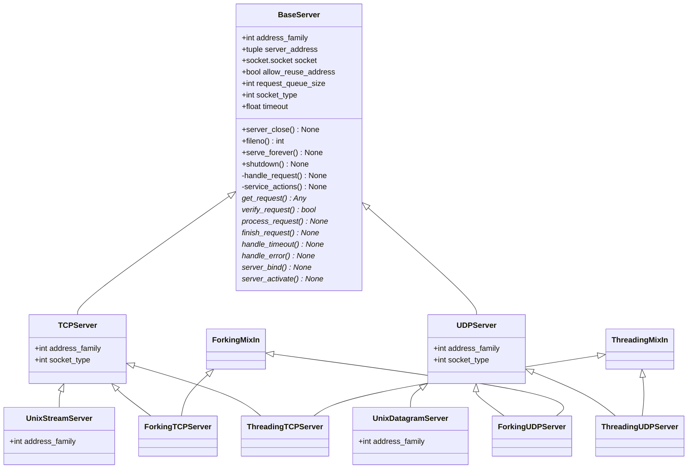

# `socketserver` - Standard Networks Server Framework

## Class Diagram



## TCP Server

```python
import socketserver

class MyTCPHandler(socketserver.BaseRequestHandler):
    """
    The request handler class for our server.

    It is instantiated once per connection to the server, and must
    override the handle() method to implement communication to the
    client.
    """

    def handle(self):
        # self.request is the TCP socket connected to the client
        self.data = self.request.recv(1024).strip()
        print(f'{self.client_address[0]} wrote: {self.data}')
        # just send back the same data, but upper-cased
        self.request.sendall(self.data.upper())


class MyTCPHandler(socketserver.StreamRequestHandler):

    def handle(self):
        # self.rfile is a file-like object created by the handler;
        # we can now use e.g. readline() instead of raw recv() calls
        self.data = self.rfile.readline().strip()
        print(f'{self.client_address[0]} wrote: {self.data}')
        # Likewise, self.wfile is a file-like object used to write back
        # to the client
        self.wfile.write(self.data.upper())


if __name__ == '__main__':
    # Create the server, binding to localhost on port 9999
    with socketserver.TCPServer(('localhost', 9999), MyTCPHandler) as server:
        # Activate the server; this will keep running until you
        # interrupt the program with Ctrl-C
        server.serve_forever()
```

## UDP Server

```python
import socketserver

class MyUDPHandler(socketserver.BaseRequestHandler):
    """
    This class works similar to the TCP handler class, except that
    self.request consists of a pair of data and client socket, and since
    there is no connection the client address must be given explicitly
    when sending data back via sendto().
    """

    def handle(self):
        data = self.request[0].strip()
        socket = self.request[1]
        print(f'{self.client_address[0]} wrote: {self.data}')
        socket.sendto(data.upper(), self.client_address)

if __name__ == "__main__":
    with socketserver.UDPServer(('localhost', 9999), MyUDPHandler) as server:
        server.serve_forever()
```

## Threaded Server

```python
import socket
import threading
import socketserver

class ThreadingTCPRequestHandler(socketserver.BaseRequestHandler):

    def handle(self):
        data = str(self.request.recv(1024), 'ascii')
        cur_thread = threading.current_thread()
        response = bytes("{}: {}".format(cur_thread.name, data), 'ascii')
        self.request.sendall(response)

def client(ip, port, message):
    with socket.socket(socket.AF_INET, socket.SOCK_STREAM) as sock:
        sock.connect((ip, port))
        sock.sendall(bytes(message, 'ascii'))
        response = str(sock.recv(1024), 'ascii')
        print(f'Received: {response}')

if __name__ == '__main__':
    # Port 0 means to select an arbitrary unused port
    server = socketserver.ThreadingTCPServer(('localhost', 0), ThreadingTCPRequestHandler)
    with server:
        ip, port = server.server_address

        # Start a thread with the server -- that thread will then start one
        # more thread for each request
        # daemon: exit the server thread when the main thread terminates
        server_thread = threading.Thread(target=server.serve_forever, daemon=True)
        server_thread.start()
        print('Server loop running in thread:', server_thread.name)

        client(ip, port, 'Hello World 1')
        client(ip, port, 'Hello World 2')
        client(ip, port, 'Hello World 3')

        server.shutdown()
```

## References

- [Python - `socket` module](https://docs.python.org/3/library/socket.html)
- [Python - `socketserver` module](https://docs.python.org/3/library/socketserver.html)
- [PEP 3151 – Reworking the OS and IO exception hierarchy](https://peps.python.org/pep-3151/)
