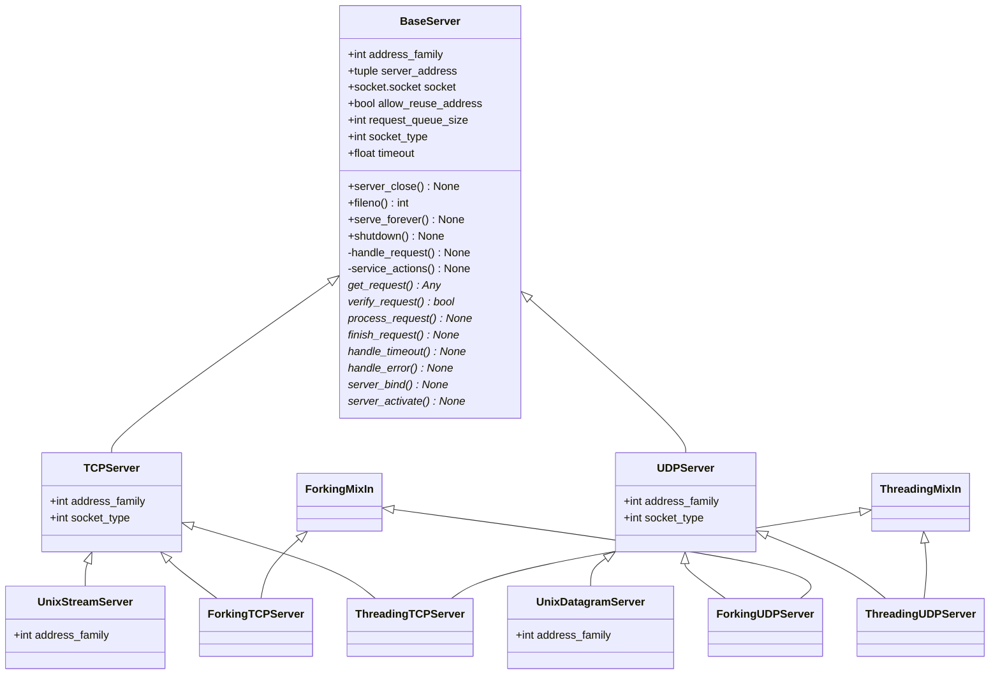

# `socketserver` - Standard Networks Server Framework

## Class Diagram



## UDP Server

```python
import socketserver


class MyUDPHandler(socketserver.BaseRequestHandler):
    """
    This class works similar to the TCP handler class, except that
    self.request consists of a pair of data and client socket, and since
    there is no connection the client address must be given explicitly
    when sending data back via sendto().
    """

    def handle(self):
        data = self.request[0].strip()
        sock = self.request[1]
        print(f'{self.client_address[0]} wrote: {self.data}')
        sock.sendto(data.upper(), self.client_address)


if __name__ == "__main__":
    with socketserver.UDPServer(('localhost', 9999), MyUDPHandler) as server:
        server.serve_forever()
```

## References

- [Python - `socket` module](https://docs.python.org/3/library/socket.html)
- [Python - `socketserver` module](https://docs.python.org/3/library/socketserver.html)
- [PEP 3151 – Reworking the OS and IO exception hierarchy](https://peps.python.org/pep-3151/)
